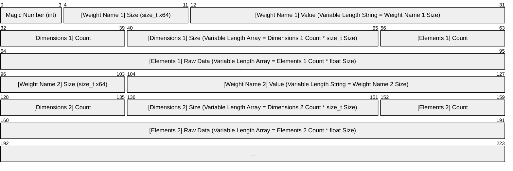
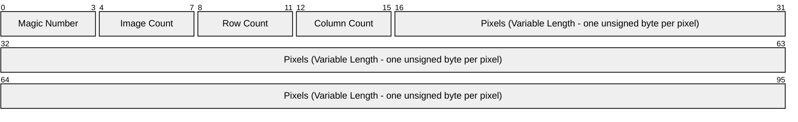

# NeuralNet
### A basic neural network built from scratch using C++.

> [!NOTE]
> This code was based on the [How to Build a Neural Network from Scratch in C++](https://www.youtube.com/watch?v=BTkIWUupQpk&list=PLrx64D7mZoumaIfuqpzvXgP2okdFXr2ol&index=1) series.
> Changes have been applied to improve performance and maintainability.
> More on that below.

## About
NeuralNet is a **C++ 17** project that utilizes the [Standard Library](https://en.cppreference.com/w/cpp/standard_library.html)
and was mainly built for fun, as well as to get a more in-depth understanding of the internals of a neural network.

While following the video series based on which the project was built, further research on each one of its building blocks was done separately.
So, this Readme file attempts to both describe the code and summarize these findings in a way that can act as a reference for anyone who might like to learn more about neural networks.

## Departures from the Video Series
Instead of directly copying the original code, I wanted to follow the series while also giving it a more personal spin.
So I decided to note ideas for possible improvements as I was going through the video series and either implement them directly,
or retroactively, after I'd finished with the rest of the code.

Some of these changes are:
- **Maintainability**
    - Reduced duplication by restructuring the code.
    - Made building and debugging easier by switching to Visual Studio (instead of using CMake).
    - Improved component separation by splitting the code into multiple projects.
    - Clarified external API by reevaluating which includes should be added in `.h` files and which should be added in `.cpp` files.
    - Decreased coupling between classes by using forward declarations (e.g. `class Tensor;`) where includes where unnecessary.
- **Performance**
    - Optimized compile times by using forward declarations (e.g. `class Tensor;`) where includes where unnecessary.
    - Optimized compile times by precompiling libraries that are used across multiple classes, or are particularly heavy.
    - Reduced training times by adding a degree of parallelism.

> [!NOTE]
> The decision to use Visual Studio instead of CMake can also have the following drawbacks, which were considered
> acceptable for the purposes of this project:
> - Portability loss, since the project is now Windows-specific.
>   _This was considered acceptable, especially because the code assumes that it's running on a little-endian system
>   (which might not always be the case when using Linux)._
> - Automation limitations, since CI/CD pipelines and build automation often prefer CMake.
>   _This was considered irrelevant to this project, because there were no plans of using any such type of automation._

## Code Structure
The solution can be built using **Visual Studio 2022** and it contains 6 different projects:
- **NeuralNet_Console**: This is the base project that contains the entry point of the application.
  It also contains the definition of a simple neural network that includes three linear layers and an activation layer
  (as defined in the rest of the code), as well as methods to encapsulate training the model and making inferences.
- **NeuralNet_Core**: C++ static library that contains the definitions of `Tensor` (the core data structure used for
  representing inputs, outputs, model parameters and intermediate computations) and `Module` (a reusable, encapsulated
  building block that represents the model's various components).
- **NeuralNet_Layers**: C++ static library that contains the classes that will be used as the neural network's main building blocks.
- **NeuralNet_Training**: C++ static library that contains classes that implement learning logic and optimization utilities.
- **NeuralNet_Data**: C++ static library that contains everything related to saving and loading both input and output data.
- **NeuralNet_Test**: Google Test project to ensure code correctness.

## Tensors
### Automatic Differentiation (Autograd)
#### Rules for Tensor Addition (Elementwise Addition)
| Forward Type | Who Broadcast? | Who Gets Gradient Summed? | Notes |
| --- | :---: | --- | --- |
| Scalar + Scalar | Neither | No summing needed | |
| Scalar + 1D | Scalar | Scalar (Sum gradients) | |
| Scalar + 2D | Scalar | Scalar (Sum gradients) | |
| 1D + Scalar | Scalar | Scalar (Sum gradients) | |
| 2D + Scalar | Scalar | Scalar (Sum gradients) | |
| 1D + 1D | Neither | No summing needed | |
| 1D + 2D | 1D | 1D (Sum over rows) | Not implemented, Covered by 1D + (2D&#8594;1D) |
| 2D + 1D | 1D | 1D (Sum over rows) | Not implemented, Covered by (2D&#8594;1D) + 1D |
| 2D + 2D | Neither | No summing needed | |

#### Rules for Tensor Multiplication (Algebraic Product - MatMul)
| Forward Type | Forward Result | Who Broadcast? | Who Gets Gradient Summed? | Notes |
| --- | :---: | :---: | --- | --- |
| 1D &#183; 1D | Scalar | Neither | No summing needed | Classic dot product (Sum over element-wise multiplication) |
| 1D &#183; 2D | 1D | 1D | 1D (Sum over rows) | Vector-matrix product |
| 2D &#183; 1D | 1D | 1D | 1D (Sum over rows) | Matrix-vector product |
| 2D &#183; 2D | 2D | Neither | No summing needed | Matrix-matrix product |

## Layers
### Flatten Layer
Reshapes inputs, usually from multi-dimensional into flat vectors, applied before fully connected layers.

### Linear Layer
Performs a *learnable affine transformation* on its input:
```mermaid
xychart-beta
    line [-4, -2, 0, 2, 4]
```
```math
y = W \cdot x + b
```
- $`x`$: Input tensor of shape `[batch_size, input_dim]`
- $`y`$: Output tensor of shape `[batch_size, output_dim]`
- $`W`$: Weight of shape `[output_dim, input_dim]`
- $`b`$: Bias vector of shape `[output_dim]`

### Rectified Linear Unit Layer (ReLU)
Applies the rectified linear unit function element-wise, essentially removing all negative values from the input tensor.
```mermaid
xychart-beta
    line [0, 0, 0, 2, 4]
```
```math
ReLU(x) = (x)^{+} = max(0,x)
```

### SoftMax Layer
Converts raw scores (logits) into probabilities, which ensures normalization of the model's outputs.
The normalized output is then compatible with various loss functions, ensuring the resulting gradients will make sense.
```math
\text{Softmax}(z_i) = \frac{e^{z_i}}{\sum_{j=1}^{C} e^{z_j}}
```

## Loss Functions
| Prediction Type | Loss Type | Loss Function | &nbsp;&nbsp;&nbsp;&nbsp;&nbsp;&nbsp;&nbsp;&nbsp;&nbsp;&nbsp;&nbsp;&nbsp;&nbsp;&nbsp;&nbsp;&nbsp;&nbsp;&nbsp;&nbsp;&nbsp;&nbsp;&nbsp;&nbsp;&nbsp;&nbsp;&nbsp;&nbsp;&nbsp;&nbsp;&nbsp;&nbsp;Formula&nbsp;&nbsp;&nbsp;&nbsp;&nbsp;&nbsp;&nbsp;&nbsp;&nbsp;&nbsp;&nbsp;&nbsp;&nbsp;&nbsp;&nbsp;&nbsp;&nbsp;&nbsp;&nbsp;&nbsp;&nbsp;&nbsp;&nbsp;&nbsp;&nbsp;&nbsp;&nbsp;&nbsp;&nbsp;&nbsp;&nbsp; | Notes |
| --- | --- | :---: | --- | --- |
| Continuous Values | Regression | Mean Squared Error | $`\text{MSE} = \frac{1}{n} \sum_{i=1}^{n} (y_i - \hat{y}_i)^2`$ | Sensitive to Outliers |
| Continuous Values | Regression | Mean Absolute Error | $`\text{MAE} = \frac{1}{n} \sum_{i=1}^{n} \mid y_i - \hat{y}_i\mid`$ | Less sensitive to outliers but not differentiable at zero |
| Continuous Values | Regression | Huber Loss | $`L_\delta = \begin{cases} \frac{1}{2} (y_i - \hat{y}_i)^2 & \text{if } \mid y_i - \hat{y}_i\mid \leq \delta \\ \delta (\mid y_i - \hat{y}_i\mid - \frac{1}{2} \delta) & \text{if } \mid y_i - \hat{y}_i\mid > \delta \end{cases}`$ | Combines MSE and MAE, quadratic for small errors, linear for large ones. Requires threshold parameter $`\delta`$ |
| Discrete Class Labels | Binary Classification | Binary Cross-Entropy (Log Loss) | $`\text{Loss} = -[y \log(p) + (1 - y) \log(1 - p)]`$ | How close predicted probabilites are to actual labels |
| Discrete Class Labels | Multi-Class Classification | Categorical Cross-Entropy | $`\text{Loss} = -\sum_{i=1}^{C} y_i \log(\hat{y}_i)`$ | Compares predicted probability distribution to the true class label (assumes one-hot encoded labels) |
| Discrete Class Labels | Multi-Class Classification | Sparse Categorical Cross-Entropy | $`\text{Loss} = -\sum_{i=1}^{C} \delta_{i,y} \log(\hat{y}_i)`$ | Used when labels are integer-encoded instead of one-hot vectors |
| Probabilistic Models | Log-Probability Classification | Negative Log-Likelihood | $`\text{NLL} = -\log(\hat{y}_y)`$ | Equivalent to sparse cross-entropy when using log-probabilities (more stable when dealing with small probabilities) |
| Probabilistic Models | Probability Distribution Divergence | Kullback-Leibler Divergence (KL Divergence) | $`D_{\text{KL}}(P \parallel Q) = \sum_i P(i) \log \left( \frac{P(i)}{Q(i)} \right)`$ | Measures divergence between two probability distributions |
| Metric Learning | Similarity (Pairwise) | Contrastive Loss | $`L = (1 - Y) \cdot D^2 + Y \cdot \max(0, m - D)^2`$ | Encourages similar items to be close; dissimilar items to be farther than margin $`m`$ |
| Metric Learning | Similarity (Triplet) | Triplet Loss | $`L = \max(0, D_{ap} - D_{an} + \alpha)`$ | Trains model to separate anchor from negative by at least margin $`\alpha`$ |

## Optimization
**Stochastic Gradient Descent (SGD)** was used as an Optimizer, to achieve minimization of the loss function by iteratively adjusting weights,
according to the defined learning rate.

## Serialization
### Stored Byte Sizes


## Training
### MNIST Dataset Structure


The numbers stored in MNIST files are in big-endian format (most significant byte first).
Conversely, most modern hardware stores numbers in little-endian format.
Since this repository contains code that's supposed to run on Windows (and no version of Windows released so far runs on big-endian architectures),
we can be certain that when reading the file we're going to interpret the raw bytes in little-endian format, thus reversing the stored number.
This is why we need to reverse the number back, so that we can interpret it correctly (i.e. most significant byte first).