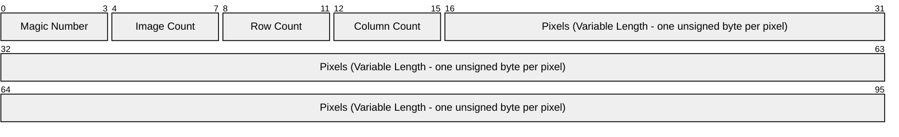
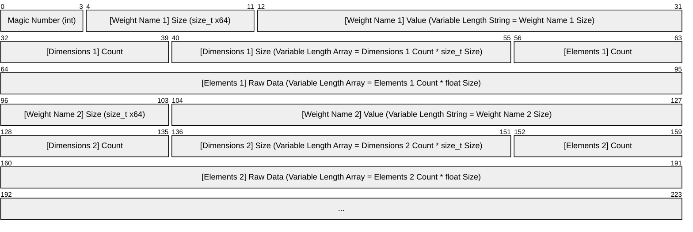

# NeuralNet
### A basic neural network built from scratch using C++.

> [!NOTE]
> This code was based on the [How to Build a Neural Network from Scratch in C++](https://www.youtube.com/watch?v=BTkIWUupQpk&list=PLrx64D7mZoumaIfuqpzvXgP2okdFXr2ol&index=1) series.
> Changes have been applied to improve performance and maintainability.
> More on that below.

## About
NeuralNet is a **C++ 20** project that utilizes the [Standard Library](https://en.cppreference.com/w/cpp/standard_library.html)
and was mainly built for fun, as well as to get a more in-depth understanding of the internals of a neural network.

While following the video series based on which the project was built, further research on each one of its building blocks was done separately.
So, this Readme file attempts to both describe the code and summarize these findings in a way that can act as a reference for anyone who might like to learn more about neural networks.

## Departures from the Video Series
Instead of directly copying the original code, I wanted to follow the series while also giving it a more personal spin.
So I decided to note ideas for possible improvements as I was going through the video series and either implement them directly,
or retroactively, after I'd finished with the rest of the code.

Some of these changes are:
- **Maintainability**
    - Reduced duplication by restructuring the code.
    - Made building and debugging easier by switching to Visual Studio (instead of using CMake).
    - Improved component separation by splitting the code into multiple projects.
    - Clarified external API by reevaluating which includes should be added in `.h` files and which should be added in `.cpp` files.
    - Decreased coupling between classes by using forward declarations (e.g. `class Tensor;`) where includes were unnecessary.
    - Parameterized the NeuralNetwork class so that it doesn't need to be redefined every time it's used.
- **Performance**
    - Optimized compile times by using forward declarations (e.g. `class Tensor;`) where includes were unnecessary.
    - Optimized compile times by using precompiled headers for libraries that are used across multiple classes, or are particularly heavy.
    - Reduced training times by adding a degree of parallelism.

> [!NOTE]
> The decision to use Visual Studio instead of CMake can also have the following drawbacks, which were considered
> acceptable for the purposes of this project:
> - Portability loss, since the project is now Windows-specific.
>   _This was considered acceptable, especially because the code assumes that it's running on a little-endian system
>   (which might not always be the case when using Linux, since it can also support architectures that may be big-endian)._
> - Automation limitations, since CI/CD pipelines and build automation often prefer CMake.
>   _This was considered irrelevant to this project, because there were no plans of using any such type of automation._

## Code Structure
The solution can be built using **Visual Studio 2022** and it contains 6 different projects:
- **NeuralNet_Console**: This is the base project that contains the entry point of the application.
- **NeuralNet_Core**: C++ static library that contains the definitions of `Tensor` (the core data structure used for
  representing inputs, outputs, model parameters and intermediate computations), `Module` (a reusable, encapsulated
  building block that represents the model's various components) and `NeuralNetwork` (a generic implementation of a neural network,
  whose structure can be parameterized upon creation).
- **NeuralNet_Layers**: C++ static library that contains the classes that will be used as the neural network's main building blocks.
- **NeuralNet_Training**: C++ static library that contains classes that implement learning logic and optimization utilities.
- **NeuralNet_Data**: C++ static library that contains everything related to saving and loading both input and output data.
- **NeuralNet_Test**: Google Test project to ensure code correctness.

## Core Concepts
- **Tensor**: Conceptually, a tensor is a container for numerical data (e.g. a scalar, a 1D vector, a 2D vector, etc.). In this
  implementation, it also encapsulates the math that's necessary for the neural network to operate (e.g. elementwise addition,
  algebraic product).
- **Input Layer**: The input layer is the first layer of a neural network, and it receives raw input data. It typically doesn't transform
  the data and only passes it into the neural network, but sometimes preprocessing also happens either before or alongside it.
  In this implementation, it also flattens its input tensors into a 1D array.
- **Output Layer**: The output layer is the last layer of a neural network, and it generates the final prediction. It can be either
  a fully connected layer (i.e. a layer where each neuron receives input from all neurons of the previous layer), an activation layer (i.e.
  implementation-wise, a wrapper for the activation function) or a combination of the two.
- **Hidden Layer**: A hidden layer is any layer that is located between the input and output layers. It applies learned transformations
  to its input, to learn patterns that help the neural network make decisions. It is called "hidden" because its output is not directly
  observed.
- **Neuron**: Conceptually, a neuron is the smallest computational unit contained in any layer. Its output is usually a scalar value
  (e.g. in a layer that produces a vector of 10 elements as its output, each element will be produced by exactly one neuron). This is why
  in practice, we often refer to a neuron's _output_ as a _neuron_, although technically that's the result of the neuron's computation.
- **Loss Function**: This is what guides the learning process in neural networks. A loss function is what quantifies the difference
  between the model's predictions and the actual values, providing a scalar value that the optimizer seeks to minimize. The type of
  loss function that gets applied is selected based on the task at hand.
- **Optimizer**: After a prediction is made and the loss is calculated, the optimizer is what achieves minimization of the loss
  by iteratively adjusting weights and biases, according to the defined learning rate.

## Core Training Steps
1. **Forward Propagation**: Input data flows through each subsequent layer of the neural network, producing an output (prediction).
2. **Loss Calculation**: The loss function measures how far the prediction is from the target value (e.g. mean squared error for
   regression, cross-entropy for classification).
3. **Backward Propagation**: During backward propagation (or backpropagation), the neural network "learns by its mistakes".
   The end goal is to minimize the output of the loss function. Backpropagation is the process of traversing the neural network's
   layers in reverse order, to generate the negative gradient of the loss function (essentially, a way of flagging certain paths as
   reinforced and others as avoided).
4. **Optimizer Update**: The optimizer (e.g. Stochastic Gradient Descent, Adam) utilizes gradients to adjust weights and biases,
   so that in future iterations (i.e. epochs) the loss can be minimized.

## Tensor Operations
The tensor class implemented here, apart from being a container for numerical data, also includes the definition of the basic mathematical
calculations (elementwise addition and algebraic product) that will be executed on each tensor, during forward and backward passes.
These are going to be the low-level building blocks of each neuron's computations.
### Automatic Differentiation (Autograd)
The calculations that are included in this tensor implementation will be used for automatic differentiation, i.e. for calculating
derivatives by breaking them down to smaller derivative calculations, whose results are known. The chain rule from calculus is used
here, and there are two possible modes:
- **Forward**: Moving from inputs to outputs, tracking both the output and the derivative at each step.
- **Reverse**: Moving from outputs back to inputs separately, accumulating gradients. This is more efficient for many inputs but few
  outputs, which is why it's most often used in deep learning. It is also what we're going to be using.
#### Rules for Reverse Tensor Addition (Elementwise Addition)
| Forward Type | Who Broadcast? | Who Gets Gradient Summed? | Notes |
| --- | :---: | --- | --- |
| Scalar + Scalar | Neither | No summing needed | |
| Scalar + 1D | Scalar | Scalar (Sum gradients) | |
| Scalar + 2D | Scalar | Scalar (Sum gradients) | |
| 1D + Scalar | Scalar | Scalar (Sum gradients) | |
| 2D + Scalar | Scalar | Scalar (Sum gradients) | |
| 1D + 1D | Neither | No summing needed | |
| 1D + 2D | 1D | 1D (Sum over rows) | Not implemented, Covered by 1D + (2D&#8594;1D) |
| 2D + 1D | 1D | 1D (Sum over rows) | Not implemented, Covered by (2D&#8594;1D) + 1D |
| 2D + 2D | Neither | No summing needed | |

#### Rules for Reverse Tensor Multiplication (Algebraic Product - MatMul)
| Forward Type | Forward Result | Who Broadcast? | Who Gets Gradient Summed? | Notes |
| --- | :---: | :---: | --- | --- |
| 1D &#183; 1D | Scalar | Neither | No summing needed | Classic dot product (Sum over element-wise multiplication) |
| 1D &#183; 2D | 1D | 1D | 1D (Sum over rows) | Vector-matrix product |
| 2D &#183; 1D | 1D | 1D | 1D (Sum over rows) | Matrix-vector product |
| 2D &#183; 2D | 2D | Neither | No summing needed | Matrix-matrix product |

## Layers
### Input Layer
An input layer is the gateway that allows incoming data to enter the neural network. Its type depends on the way that the neural network's
input data has been structured.

| Input Layer Type | Data Type | Typical Use Case | Notes |
| --- | --- | --- | --- |
| Fully Connected | Flat numerical vectors | Tabular data, simple regression/classification tasks | Each input feature maps to one neuron |
| Flatten | Multi-dimensional arrays (e.g. images) | Image classification, transitioning from convolutional layers | Converts 2D/3D tensors to 1D vectors |
| Conv1D | 1D sequential data | Time series analysis, audio signals | Used for patterns in sequences |
| Conv2D | 2D spatial data (e.g. images) | Image recognition, object detection | Preserves spatial structure for convolution |
| Conv3D | 3D spatial data (e.g. video, volumetric scans) | Medical imaging, video classification | Handles width, height and depth |
| Embedding | Categorical or tokenized text | Natural Language Processing (NLP), recommendation systems | Maps discrete tokens to dense vectors |
| Sequence | Ordered sequences (e.g. text, time series) | NLP, speech recognition, forecasting | Often used with RNNs, LSTMs, Transformers |
| Sparse | Sparse vectors (many zeros) | High-dimensional data like text (bag-of-words) | Optimized for memory and speed |
| Image | Pixel data | Computer vision tasks | Often includes shape and channel info |
| Custom | Mixed or structured data | Multimodal models (e.g. combining text and images) | Can be tailored to specific architectures |

#### Flatten Layer
This is the input layer that we'll be using in this implementation. It is typically used for reshaping its inputs (e.g. images) into flat vectors,
which will then be passed as input to the next layer.

### Hidden Layer
A hidden layer is located "inside" the neural network (i.e. it does not directly receive data from the outside world or provide predictions to it).
It transforms its inputs into a different form to enable learning. Its type depends on the type of problem that the neural network is trying
to solve.

| Hidden Layer Type | Used For | Typical Use Case | Key Characteristics |
| --- | --- | --- | --- |
| Fully Connected | General purpose learning | Tabular data, simple classification or regression | Every neuron connects to every neuron in the previous layer |
| Convolutional (Conv1D/Conv2D/Conv3D) | Spatial or sequential feature extraction | Image recognition, audio analysis, video classification | Learns local patterns using filters; preserves spatial structure |
| Recurrent (RNN) | Sequential data | Time series forecasting, text generation, speech recognition | Maintains memory of previous inputs; good for temporal dependencies |
| LSTM (Long Short-Term Memory) | Long-range dependencies in sequences | Language modeling, translation, music generation | Specialized RNN that avoids vanishing gradient problem |
| GRU (Gated Recurrent Unit) | Efficient sequence modelling | Similar to LSTM, but faster to train | Fewer gates than LSTM; balances performance and complexity |
| Transformer Encoder | Attention-based sequence modelling | NLP tasks, vision transformers, recommendation systems | Uses self-attention to model relationships between all input positions |
| Autoencoder Bottleneck | Dimensionality reduction | Data compression, anomaly detection | Learns compressed representation of input data |
| Attention | Focused feature weighting | Translation, summarization, multimodal learning | Learns to focus on relevant parts of input dynamically |
| Residual | Deep networks | Image classification (ResNet), deep architectures | Adds input back to output to preserve information and ease training; in most frameworks this is a connection pattern instead of a dedicated layer |
| Batch Normalization | Stabilizing training | Any deep network | Normalizes activations to reduce internal covariate shift (auxiliary/regularization layer) |
| Dropout | Regularization | Preventing overfitting in any model | Randomly disables neurons during training to improve generalization (auxiliary/regularization layer) |

#### Fully Connected Layer
The fully connected (or dense) layer is the linear layer that applies a _learnable affine transformation_ to its inputs. An affine transformation
is just a linear transformation (matrix multiplication) followed by a translation (the addition of a bias vector). In geometry, these
operations preserve points, straight lines, and planes (i.e. they maintain "affine structure"). Specifically in neural networks, the weight
and bias parameters are not fixed. The model _learns_ them by minimizing a loss function during training, using backpropagation and gradient
descent. So, the transformation is learnable, because the neural network tunes weight and bias to fit the data.

When defining a dense layer, knowing the number of input and output features is necessary. The number of input features is the number of
neurons produced by the previous layer and the number of output features is the number of neurons that this layer will produce.
So a layer with 10 input neurons and 5 output neurons is a layer with a weight tensor of shape [5,10] and a bias tensor of shape [5].
```mermaid
xychart-beta
    line [-4, -2, 0, 2, 4]
```
```math
y = W \cdot x + b
```
- $`x`$: Input tensor of shape `[batch_size, input_dim]`
- $`y`$: Output tensor of shape `[batch_size, output_dim]`
- $`W`$: Weight of shape `[output_dim, input_dim]` (learnable parameter, updated during training)
- $`b`$: Bias vector of shape `[output_dim]` (learnable parameter, updated during training)

#### Activation Layer
Because executing multiple linear transformations one after the other would just lead to a different linear transformation, applying
activation functions is necessary, to introduce nonlinearity to the neural network. This helps the neural network identify and represent complex
patterns or relationships in the data.

The activation layer is a software abstraction that wraps an activation function so that it can be easily defined as part of the model graph.
It can be used as either a **hidden** layer or the **output** layer and technically it can follow any type of layer that produces a tensor
(for example, it can be used after convolutional layers).

Activation functions can either be applied element-wise (i.e. pointwise) or vector-level:
- **element-wise**: Each output only depends on its own input, and thus ensures no interaction between elements. This is the default choice for _most_ hidden layers.
- **vector-level**: Each output also depends on the whole vector, and may enforce constraints or introduce competition and cooperation between elements.
  Can be used for probabilities, rankings or normalized weights.

Some of the most common activation functions are the following:

| Function | &nbsp;&nbsp;&nbsp;&nbsp;&nbsp;&nbsp;&nbsp;&nbsp;&nbsp;&nbsp;&nbsp;&nbsp;&nbsp;&nbsp;&nbsp;&nbsp;&nbsp;&nbsp;Formula&nbsp;&nbsp;&nbsp;&nbsp;&nbsp;&nbsp;&nbsp;&nbsp;&nbsp;&nbsp;&nbsp;&nbsp;&nbsp;&nbsp;&nbsp;&nbsp;&nbsp;&nbsp; | Level | &nbsp;Output&nbsp;Range&nbsp; | Description |
| --- | :---: | :---: | :---: | --- |
| Sigmoid | $`\sigma(x) = \frac{1}{1 + e^{-x}}`$ | Element | $`(0, 1)`$ | S-shaped; maps input to probability-like values; can cause vanishing gradients for large $`x`$ |
| Tanh | $`\tanh(x) = \frac{e^x - e^{-x}}{e^x + e^{-x}}`$ | Element | $`(-1, 1)`$ | S-shaped; zero-centered output for balanced updates |
| Softmax | $`\text{Softmax}(z_i) = \frac{e^{z_i}}{\sum_{j=1}^{C} e^{z_j}}`$ | Vector | $`(0, 1)`$, sum=1 | Converts a vector of raw scores (logits) into a probability distribution over $`C`$ classes |
| ReLU | $`\text{ReLU}(x) = \max(0, x)`$ | Element | $`[0, \infty)`$ | Passes positive values; zeros out negatives |
| Leaky ReLU | $`\text{LReLU}(x) = \max(\alpha x, x)`$ | Element | $`(-\infty, \infty)`$ | Like ReLU but allows small slope for negatives; $`a`$ is typically small |
| ELU | $`\text{ELU}(x) = \begin{cases} x & x > 0 \\ \alpha(e^x - 1) & x \le 0 \end{cases}`$ | Element | $`(-\alpha, \infty)`$ | Exponential Linear Unit; like Leaky ReLU, but with exponential curve; can speed up learning |
| Softplus | $`\text{Softplus}(x) = \ln(1 + e^x)`$ | Element | $`(0, \infty)`$ | Smooth approximaton of ReLU; always positive and differentiable everywhere; avoids the "dead neuron" problem |

In the context of hidden layers, GELU, Swish and Mish are also increasing in popularity, but we won't be covering those here.

Softmax is not the only activation function that operates on the vector level, but the rest (such as Sparsemax or Softmin) are similar enough and thus we won't be covering them.

##### Rectified Linear Unit Layer (ReLU)
This is the activation layer implementation that we'll be using for the hidden layers. It applies the rectified linear unit function element-wise,
essentially removing all negative values from its input tensor.
```mermaid
xychart-beta
    line [0, 0, 0, 2, 4]
```
```math
ReLU(x) = (x)^{+} = max(0,x)
```

### Output Layer
An output layer is the final step that generates a neural network's output (the prediction). It can be either a linear layer
(in cases when no activation function is applied), or an activation layer (which is an easy way to implement a standalone
activation function). Its type depends on the type of problem that the neural network is trying to solve.
The output layer may sometimes be implemented as part of the loss function.

| Problem Type | Output Layer | Shape | Typical Interpretation | Common Loss Function | Use Cases |
| --- | --- | --- | --- | --- | --- |
| Binary Classification | Sigmoid | 1 neuron | Probability of the positive class | Binary Cross-Entropy | Spam detection, medical test results, sentiment analysis |
| Multi-Class Classification (Single Label) | Softmax | n neurons (1 per class) | Probability distribution over mutually exclusive classes | Categorical Cross-Entropy | Handwritten digit recognition, image classification, language identification |
| Multi-Label Classification | Sigmoid (per output) | n neurons (1 per label) | Independent probability for each label | Binary Cross-Entropy | Tagging images with multiple objects, music genre classification, multi-topic text tagging |
| Regression (Unbounded) | Linear (no activation) | 1+ neurons | Direct numeric prediction | MSE, MAE | Predicting house prices, forecasting stock prices, predicting temperature |
| Regression (Bounded Range) | Sigmoid or Tanh | 1 neuron | Numeric prediction constrained to a range | MSE, MAE | Predicting normalized ratings, bounded physical measurements, probability estimates |
| Ordinal Regression | Softmax or Sigmoid (special encoding) | n neurons | Ordered category prediction | Cross-Entropy with Ordinal encoding, MSE | Customer satisfaction rating, education level classification |
| Probability Density Estimation | Softmax or Linear (with constraints) | Depends on bins or parameters | Outputs parameters of a distribution | NLL | Mixture density networks for trajectory prediction, speech synthesis |
| Autoencoder Reconstruction | Sigmoid (normalized data) or Linear (raw data) | Same as input | Reconstructed input | MSE, Binary Cross-Entropy | Image denoising, dimensionality reduction, anomaly detection |
| Generative Models (e.g. GAN) | Tanh or Sigmoid | Shape of generated sample | Generated data sample | Adversarial Loss | Image generation, super-resolution |
| Language Models (next-token prediction) | Softmax | Vocabulary size | Probability distribution over next token | Cross-Entropy | Chatbots, text completion, machine translation |

#### SoftMax Layer
This is going to be the output layer of this neural network implementation. Its purpose is to apply the softmax function, which
converts raw scores (logits) into probabilities and ensures the normalization of the model's outputs (commonly used in multi-class
classification, where outputs sum to 1 across classes).

The normalized output generated by this layer is compatible with various loss functions (often paired with cross-entropy loss),
ensuring the resulting gradients will make sense.
```math
\text{Softmax}(z_i) = \frac{e^{z_i}}{\sum_{j=1}^{C} e^{z_j}}
```

## Loss Functions
What follows is a mapping between various loss functions, their formulas and the type of predictions to which they can be applied.

In this case, we're going to be using **Cross-Entropy** loss.

| Prediction Type | Loss Type | Loss Function | &nbsp;&nbsp;&nbsp;&nbsp;&nbsp;&nbsp;&nbsp;&nbsp;&nbsp;&nbsp;&nbsp;&nbsp;&nbsp;&nbsp;&nbsp;&nbsp;&nbsp;&nbsp;&nbsp;&nbsp;&nbsp;&nbsp;&nbsp;&nbsp;&nbsp;&nbsp;&nbsp;&nbsp;&nbsp;&nbsp;&nbsp;Formula&nbsp;&nbsp;&nbsp;&nbsp;&nbsp;&nbsp;&nbsp;&nbsp;&nbsp;&nbsp;&nbsp;&nbsp;&nbsp;&nbsp;&nbsp;&nbsp;&nbsp;&nbsp;&nbsp;&nbsp;&nbsp;&nbsp;&nbsp;&nbsp;&nbsp;&nbsp;&nbsp;&nbsp;&nbsp;&nbsp;&nbsp; | Notes |
| --- | --- | :---: | --- | --- |
| Continuous Values | Regression | Mean Squared Error | $`\text{MSE} = \frac{1}{n} \sum_{i=1}^{n} (y_i - \hat{y}_i)^2`$ | Sensitive to Outliers |
| Continuous Values | Regression | Mean Absolute Error | $`\text{MAE} = \frac{1}{n} \sum_{i=1}^{n} \mid y_i - \hat{y}_i\mid`$ | Less sensitive to outliers but not differentiable at zero |
| Continuous Values | Regression | Huber Loss | $`L_\delta = \begin{cases} \frac{1}{2} (y_i - \hat{y}_i)^2 & \text{if } \mid y_i - \hat{y}_i\mid \leq \delta \\ \delta (\mid y_i - \hat{y}_i\mid - \frac{1}{2} \delta) & \text{if } \mid y_i - \hat{y}_i\mid > \delta \end{cases}`$ | Combines MSE and MAE, quadratic for small errors, linear for large ones. Requires threshold parameter $`\delta`$ |
| Discrete Class Labels | Binary Classification | Binary Cross-Entropy (Log Loss) | $`L_{\text{BCE}} = -\left[ y \log(\hat{y}) + (1 - y) \log(1 - \hat{y}) \right]`$ | How close predicted probabilities are to actual labels |
| Discrete Class Labels | Multi-Class Classification | Categorical Cross-Entropy | $`L_{\text{CCE}} = -\sum_{i=1}^{C} y_i \log(\hat{y}_i)`$ | Compares predicted probability distribution to the true class label (assumes one-hot encoded labels) |
| Discrete Class Labels | Multi-Class Classification | Sparse Categorical Cross-Entropy | $`L_{\text{SCCE}} = -\sum_{i=1}^{C} \delta_{i,y} \log(\hat{y}_i)`$ | Used when labels are integer-encoded instead of one-hot vectors, where $`y`$ is the integer class index |
| Probabilistic Models | Log-Probability Classification | Negative Log-Likelihood | $`\text{NLL} = -\log(\hat{y}_y)`$ | Equivalent to sparse cross-entropy when using log-probabilities (more stable when dealing with small probabilities) |
| Probabilistic Models | Probability Distribution Divergence | Kullback-Leibler Divergence (KL Divergence) | $`D_{\text{KL}}(P \parallel Q) = \sum_i P(i) \log \left( \frac{P(i)}{Q(i)} \right)`$ | Measures divergence between two probability distributions; calculation is asymmetric, meaning $`D_{\text{KL}}(P \parallel Q) \not= D_{\text{KL}}(Q \parallel P)`$ |
| Metric Learning | Similarity (Pairwise) | Contrastive Loss | $`L_{\text{cont}} = (1 - Y) \cdot D^2 + Y \cdot \max(0, m - D)^2`$ | Encourages similar items to be close and dissimilar items to be farther than margin $`m`$ ($`Y`$ is usually 0 for similar, 1 for dissimilar pairs) |
| Metric Learning | Similarity (Triplet) | Triplet Loss | $`L_{\text{triplet}} = \max(0, D_{ap} - D_{an} + \alpha)`$ | Trains model to separate anchor from negative by at least margin $`\alpha`$ |

## Optimizer Types
What follows is a brief description of the most commonly used types of optimizers in neural network training.

In this case, we're going to be using a **Stochastic Gradient Descent** optimizer.

| Optimizer | Description | Key Features / Notes |
| --- | --- | --- |
| SGD (Stochastic Gradient Descent) | Updates parameters using a single sample (rarely) or mini-batch (more common) | Simple and widely used; sensitive to learning rate |
| SGD with Momentum | Adds a velocity term to accelerate updates in consistent gradient directions | Helps avoid local minima and slow convergence |
| Nesterov Accelerated Gradient (NAG) | Like momentum, but looks ahead (applies the momentum step) before computing gradient | More responsive to changes in gradient direction |
| Adagrad | Adaptive learning rates for each parameter based on historical gradients (scales learning rates inversely proportional to the square root of the sum of past squared gradients) | Good for sparse data; learning rate shrinks over time |
| RMSprop | Maintains an exponentially decaying moving average of squared gradients | Solves Adagrad’s shrinking learning rate problem |
| Adam (Adaptive Moment Estimation) | Combines momentum and RMSprop ideas; keeps moving averages of both gradients (first moment) and squared gradients (second moment) | Most popular; efficient and adaptive |
| AdamW | Adam with decoupled weight decay | Better regularization for large models; improves generalization |
| AdaMax | Variant of Adam that replaces the second moment estimate with the infinity norm | More stable in some cases |
| Nadam | Adam + Nesterov accelerated gradient | Faster convergence in some settings |
| FTRL (Follow-The-Regularized-Leader) | Combines L1 and L2 regularization, good for sparse data | Often used in large-scale recommendation systems; especially suited for online learning and very large sparse datasets |
| L-BFGS | Quasi-Newton method, uses second-order approximation for the inverse Hessian | Not common in deep learning due to memory overhead; useful for smaller models |
| AMSGrad | Modification of Adam that ensures the second moment estimate never decreases | Fixes potential non-convergence of Adam |

## Training Sets
### MNIST Dataset Structure
To train our model, we're going to be using the **MNIST** and **FashionMNIST** datasets. Each of these datasets is structured as a set of:
- Training Images
- Training Labels
- Testing Images
- Testing Labels

All of those files are stored in the same way, i.e. in binary format, with a fixed header that's followed by pixel data.
The following diagram shows the structure of an image file (sizes are in bytes).

### Endianness
The numbers stored in MNIST files are in big-endian format (most significant byte first).
Conversely, most modern hardware, stores numbers in little-endian format (least significant byte first).
Since this repository contains code that's supposed to run on Windows (and no version of Windows released so far runs on big-endian architectures),
we can be certain that when reading the file we're going to interpret the raw bytes in little-endian format, thus reversing the stored number.
This is why, after reading, we need to reverse the number back, so that we can interpret it correctly (i.e. most significant byte first).

## Model Serialization
The model's parameters (its saved state) are stored in a compact, binary format. A unique "magic number" at the start of the file is used
for format identification, preventing attempts to load incompatible files. Each learned weight is identified by its size, name, dimensions and
actual elements. Variable-length fields allow for the flexible storage of information, enabling efficient saving and loading of model weights.
### Stored Byte Sizes


## Not Implemented
- **Data Augmentation**: The training data is not transformed in any way (apart from its conversion to numerical vectors).
  Images are not rotated, flipped or scaled. This would help the trained model generalize better and not overfit, but
  image processing is an entire domain on its own, and can be decoupled completely from this project.
- **Gradient Clipping**: The magnitude of gradients during backpropagation is not constrained in any way. This is
  because the implemented neural network is neither recurrent (i.e. the order of inputs doesn't matter), nor very deep,
  so exploding gradients are unlikely.
- **Early Stopping**: The training process doesn't halt as soon as performance stops improving. This could be useful
  for this project, and might be implemented in the future.
