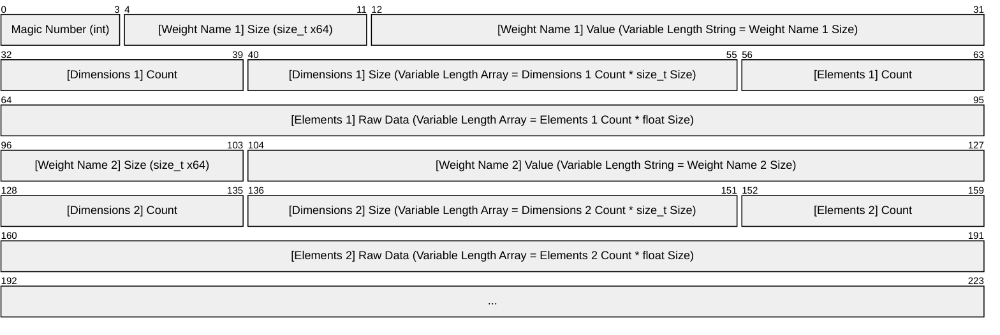

# NeuralNet

## Tensors
### Automatic Differentiation (Autograd)
#### Rules for Tensor Addition (Elementwise Addition)
| Forward Type | Who Broadcast? | Who Gets Gradient Summed? | Notes |
| --- | :---: | --- | --- |
| Scalar + Scalar | Neither | No summing needed | |
| Scalar + 1D | Scalar | Scalar (Sum gradients) | |
| Scalar + 2D | Scalar | Scalar (Sum gradients) | |
| 1D + Scalar | Scalar | Scalar (Sum gradients) | |
| 2D + Scalar | Scalar | Scalar (Sum gradients) | |
| 1D + 1D | Neither | No summing needed | |
| 1D + 2D | 1D | 1D (Sum over rows) | Not implemented, Covered by 1D + (2D&#8594;1D) |
| 2D + 1D | 1D | 1D (Sum over rows) | Not implemented, Covered by (2D&#8594;1D) + 1D |
| 2D + 2D | Neither | No summing needed | |

#### Rules for Tensor Multiplication (Algebraic Product - MatMul)
| Forward Type | Forward Result | Who Broadcast? | Who Gets Gradient Summed? | Notes |
| --- | :---: | :---: | --- | --- |
| 1D &#183; 1D | Scalar | Neither | No summing needed | Classic dot product (Sum over element-wise multiplication) |
| 1D &#183; 2D | 1D | 1D | 1D (Sum over rows) | Vector-matrix product |
| 2D &#183; 1D | 1D | 1D | 1D (Sum over rows) | Matrix-vector product |
| 2D &#183; 2D | 2D | Neither | No summing needed | Matrix-matrix product |

## Layers
### Flatten Layer
Reshapes inputs, usually from multi-dimensional into flat vectors, applied before fully connected layers.

### Linear Layer
Performs a *learnable affine transformation* on its input:
```mermaid
xychart-beta
    line [-4, -2, 0, 2, 4]
```
```math
y = W \cdot x + b
```
- $`x`$: Input tensor of shape `[batch_size, input_dim]`
- $`y`$: Output tensor of shape `[batch_size, output_dim]`
- $`W`$: Weight of shape `[output_dim, input_dim]`
- $`b`$: Bias vector of shape `[output_dim]`

### Rectified Linear Unit Layer (ReLU)
Applies the rectified linear unit function element-wise, essentially removing all negative values from the input tensor.
```mermaid
xychart-beta
    line [0, 0, 0, 2, 4]
```
```math
ReLU(x) = (x)^{+} = max(0,x)
```

## Serialization
### Stored Byte Sizes

