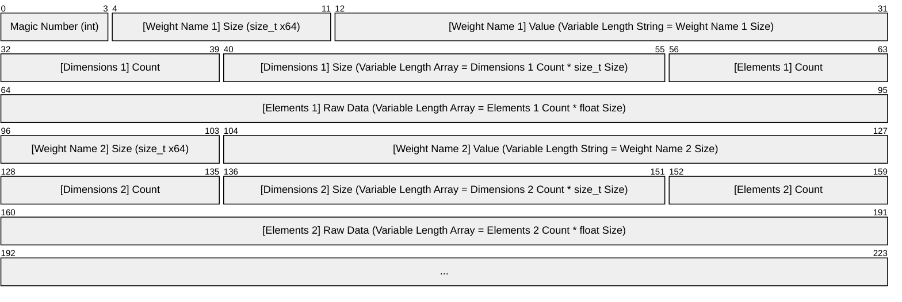
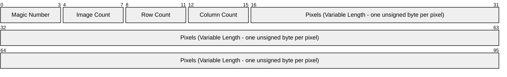

# NeuralNet

## Tensors
### Automatic Differentiation (Autograd)
#### Rules for Tensor Addition (Elementwise Addition)
| Forward Type | Who Broadcast? | Who Gets Gradient Summed? | Notes |
| --- | :---: | --- | --- |
| Scalar + Scalar | Neither | No summing needed | |
| Scalar + 1D | Scalar | Scalar (Sum gradients) | |
| Scalar + 2D | Scalar | Scalar (Sum gradients) | |
| 1D + Scalar | Scalar | Scalar (Sum gradients) | |
| 2D + Scalar | Scalar | Scalar (Sum gradients) | |
| 1D + 1D | Neither | No summing needed | |
| 1D + 2D | 1D | 1D (Sum over rows) | Not implemented, Covered by 1D + (2D&#8594;1D) |
| 2D + 1D | 1D | 1D (Sum over rows) | Not implemented, Covered by (2D&#8594;1D) + 1D |
| 2D + 2D | Neither | No summing needed | |

#### Rules for Tensor Multiplication (Algebraic Product - MatMul)
| Forward Type | Forward Result | Who Broadcast? | Who Gets Gradient Summed? | Notes |
| --- | :---: | :---: | --- | --- |
| 1D &#183; 1D | Scalar | Neither | No summing needed | Classic dot product (Sum over element-wise multiplication) |
| 1D &#183; 2D | 1D | 1D | 1D (Sum over rows) | Vector-matrix product |
| 2D &#183; 1D | 1D | 1D | 1D (Sum over rows) | Matrix-vector product |
| 2D &#183; 2D | 2D | Neither | No summing needed | Matrix-matrix product |

## Layers
### Flatten Layer
Reshapes inputs, usually from multi-dimensional into flat vectors, applied before fully connected layers.

### Linear Layer
Performs a *learnable affine transformation* on its input:
```mermaid
xychart-beta
    line [-4, -2, 0, 2, 4]
```
```math
y = W \cdot x + b
```
- $`x`$: Input tensor of shape `[batch_size, input_dim]`
- $`y`$: Output tensor of shape `[batch_size, output_dim]`
- $`W`$: Weight of shape `[output_dim, input_dim]`
- $`b`$: Bias vector of shape `[output_dim]`

### Rectified Linear Unit Layer (ReLU)
Applies the rectified linear unit function element-wise, essentially removing all negative values from the input tensor.
```mermaid
xychart-beta
    line [0, 0, 0, 2, 4]
```
```math
ReLU(x) = (x)^{+} = max(0,x)
```

### SoftMax Layer
Converts raw scores (logits) into probabilities, which ensures normalization of the model's outputs.
The normalized output is then compatible with various loss functions, ensuring the resulting gradients will make sense.
```math
\text{Softmax}(z_i) = \frac{e^{z_i}}{\sum_{j=1}^{C} e^{z_j}}
```

## Loss Functions
| Prediction Type | Loss Type | Loss Function | &nbsp;&nbsp;&nbsp;&nbsp;&nbsp;&nbsp;&nbsp;&nbsp;&nbsp;&nbsp;&nbsp;&nbsp;&nbsp;&nbsp;&nbsp;&nbsp;&nbsp;&nbsp;&nbsp;&nbsp;&nbsp;&nbsp;&nbsp;&nbsp;&nbsp;&nbsp;&nbsp;&nbsp;&nbsp;&nbsp;&nbsp;Formula&nbsp;&nbsp;&nbsp;&nbsp;&nbsp;&nbsp;&nbsp;&nbsp;&nbsp;&nbsp;&nbsp;&nbsp;&nbsp;&nbsp;&nbsp;&nbsp;&nbsp;&nbsp;&nbsp;&nbsp;&nbsp;&nbsp;&nbsp;&nbsp;&nbsp;&nbsp;&nbsp;&nbsp;&nbsp;&nbsp;&nbsp; | Notes |
| --- | --- | :---: | --- | --- |
| Continuous Values | Regression | Mean Squared Error | $`\text{MSE} = \frac{1}{n} \sum_{i=1}^{n} (y_i - \hat{y}_i)^2`$ | Sensitive to Outliers |
| Continuous Values | Regression | Mean Absolute Error | $`\text{MAE} = \frac{1}{n} \sum_{i=1}^{n} \mid y_i - \hat{y}_i\mid`$ | Less sensitive to outliers but not differentiable at zero |
| Continuous Values | Regression | Huber Loss | $`L_\delta = \begin{cases} \frac{1}{2} (y_i - \hat{y}_i)^2 & \text{if } \mid y_i - \hat{y}_i\mid \leq \delta \\ \delta (\mid y_i - \hat{y}_i\mid - \frac{1}{2} \delta) & \text{if } \mid y_i - \hat{y}_i\mid > \delta \end{cases}`$ | Combines MSE and MAE, quadratic for small errors, linear for large ones. Requires threshold parameter $`\delta`$ |
| Discrete Class Labels | Binary Classification | Binary Cross-Entropy (Log Loss) | $`\text{Loss} = -[y \log(p) + (1 - y) \log(1 - p)]`$ | How close predicted probabilites are to actual labels |
| Discrete Class Labels | Multi-Class Classification | Categorical Cross-Entropy | $`\text{Loss} = -\sum_{i=1}^{C} y_i \log(\hat{y}_i)`$ | Compares predicted probability distribution to the true class label (assumes one-hot encoded labels) |
| Discrete Class Labels | Multi-Class Classification | Sparse Categorical Cross-Entropy | $`\text{Loss} = -\sum_{i=1}^{C} \delta_{i,y} \log(\hat{y}_i)`$ | Used when labels are integer-encoded instead of one-hot vectors |
| Probabilistic Models | Log-Probability Classification | Negative Log-Likelihood | $`\text{NLL} = -\log(\hat{y}_y)`$ | Equivalent to sparse cross-entropy when using log-probabilities (more stable when dealing with small probabilities) |
| Probabilistic Models | Probability Distribution Divergence | Kullback-Leibler Divergence (KL Divergence) | $`D_{\text{KL}}(P \parallel Q) = \sum_i P(i) \log \left( \frac{P(i)}{Q(i)} \right)`$ | Measures divergence between two probability distributions |
| Metric Learning | Similarity (Pairwise) | Contrastive Loss | $`L = (1 - Y) \cdot D^2 + Y \cdot \max(0, m - D)^2`$ | Encourages similar items to be close; dissimilar items to be farther than margin $`m`$ |
| Metric Learning | Similarity (Triplet) | Triplet Loss | $`L = \max(0, D_{ap} - D_{an} + \alpha)`$ | Trains model to separate anchor from negative by at least margin $`\alpha`$ |

## Serialization
### Stored Byte Sizes


## Training
### MNIST Dataset Structure

