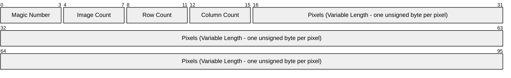
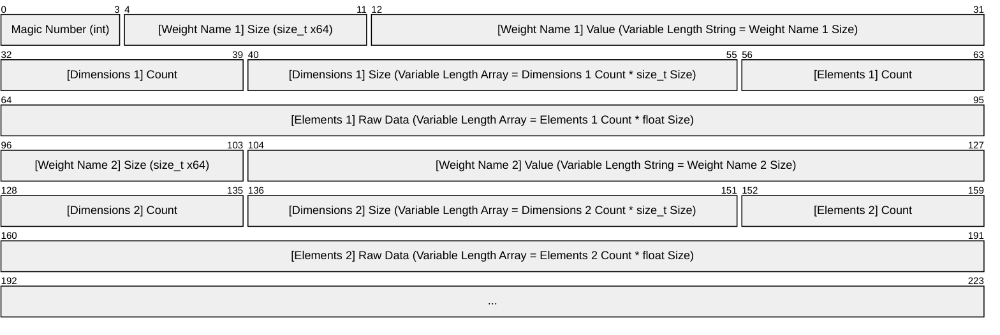

# NeuralNet
### A basic neural network built from scratch using C++.

> [!NOTE]
> This code was based on the [How to Build a Neural Network from Scratch in C++](https://www.youtube.com/watch?v=BTkIWUupQpk&list=PLrx64D7mZoumaIfuqpzvXgP2okdFXr2ol&index=1) series.
> Changes have been applied to improve performance and maintainability.
> More on that below.

## About
NeuralNet is a **C++ 20** project that utilizes the [Standard Library](https://en.cppreference.com/w/cpp/standard_library.html)
and was mainly built for fun, as well as to get a more in-depth understanding of the internals of a neural network.

While following the video series based on which the project was built, further research on each one of its building blocks was done separately.
So, this Readme file attempts to both describe the code and summarize these findings in a way that can act as a reference for anyone who might like to learn more about neural networks.

## Departures from the Video Series
Instead of directly copying the original code, I wanted to follow the series while also giving it a more personal spin.
So I decided to note ideas for possible improvements as I was going through the video series and either implement them directly,
or retroactively, after I'd finished with the rest of the code.

Some of these changes are:
- **Maintainability**
    - Reduced duplication by restructuring the code.
    - Made building and debugging easier by switching to Visual Studio (instead of using CMake).
    - Improved component separation by splitting the code into multiple projects.
    - Clarified external API by reevaluating which includes should be added in `.h` files and which should be added in `.cpp` files.
    - Decreased coupling between classes by using forward declarations (e.g. `class Tensor;`) where includes were unnecessary.
    - Parameterized the NeuralNetwork class so that it doesn't need to be redefined every time it's used.
- **Performance**
    - Optimized compile times by using forward declarations (e.g. `class Tensor;`) where includes were unnecessary.
    - Optimized compile times by using precompiled headers for libraries that are used across multiple classes, or are particularly heavy.
    - Reduced training times by adding a degree of parallelism.

> [!NOTE]
> The decision to use Visual Studio instead of CMake can also have the following drawbacks, which were considered
> acceptable for the purposes of this project:
> - Portability loss, since the project is now Windows-specific.
>   _This was considered acceptable, especially because the code assumes that it's running on a little-endian system
>   (which might not always be the case when using Linux, since it can also support architectures that may be big-endian)._
> - Automation limitations, since CI/CD pipelines and build automation often prefer CMake.
>   _This was considered irrelevant to this project, because there were no plans of using any such type of automation._

## Code Structure
The solution can be built using **Visual Studio 2022** and it contains 6 different projects:
- **NeuralNet_Console**: This is the base project that contains the entry point of the application.
- **NeuralNet_Core**: C++ static library that contains the definitions of `Tensor` (the core data structure used for
  representing inputs, outputs, model parameters and intermediate computations), `Module` (a reusable, encapsulated
  building block that represents the model's various components) and `NeuralNetwork` (a generic implementation of a neural network,
  whose structure can be parameterized upon creation).
- **NeuralNet_Layers**: C++ static library that contains the classes that will be used as the neural network's main building blocks.
- **NeuralNet_Training**: C++ static library that contains classes that implement learning logic and optimization utilities.
- **NeuralNet_Data**: C++ static library that contains everything related to saving and loading both input and output data.
- **NeuralNet_Test**: Google Test project to ensure code correctness.

## Core Components
- **Tensor**: Conceptually, a tensor is a container for numerical data. In our implementation, it also encapsulates the math that's
  necessary for the neural network to operate.
- **Input Layer**: The input layer usually operates on tensors of various sizes, reshaping them into flat vectors
  on which the rest of the transformations will be applied.
- **Fully Connected Layer**: The fully connected (or dense) layer is the most important part of a neural network.
  It is the code that applies a _learnable affine transformation_ to its inputs. An affine transformation is just a linear
  transformation (matrix multiplication) followed by a translation (the addition of a bias vector). In geometry, these operations
  preserve points, straight lines, and planes (they maintain "affine structure"). Specifically in neural networks, the weight and bias
  parameters are not fixed. The model learns them by minimizing a loss function during training, using backpropagation and gradient
  descent. So, the transformation is learnable, because the neural network tunes weight and bias to fit the data.
- **Neuron**: Conceptually, a neuron is the smallest computational unit contained in a layer. Its output is a scalar value.
  When implementing a neural network, we may refer to a neuron's output as a neuron, for simplicity reasons. When defining a dense layer,
  knowing the number of input and output features is necessary. The number of input features is the number of
  neurons produced by the previous layer and the number of output features is the number of neurons that this layer will produce.
  So a layer with 10 input neurons and 5 output neurons is a layer with a weight tensor of shape [5,10] and a bias tensor of shape [5].
- **Activation Layer**: Because executing multiple linear transformations one after the other would just lead to
  a different linear transformation, an activation function is necessary, to introduce nonlinearity to the neural network.
  This helps the neural network identify and represent complex patterns or relationships in the data. The activation layer
  is a software abstraction that wraps the activation function so that it can be easily defined as part of the model graph.
- **Loss Function**: This is what guides the learning process in neural networks. A loss function is what quantifies the difference
  between the model's predictions and the actual values, providing feedback to minimize errors. The type of loss function that gets
  applied is selected based on the task at hand.
- **Optimizer**: After a prediction is made and the loss is calculated, the optimizer is what achieves minimization of the loss
  by iteratively adjusting weights and biases, according to the defined learning rate.

## Core Training Steps
1. **Forward Propagation**: Input data flows through each subsequent layer of the neural network, producing an output (prediction).
2. **Loss Calculation**: The loss function measures how far the prediction is from the target value (e.g. mean squared error for
   regression, cross-entropy for classification).
3. **Backward Propagation**: During backward propagation (or backpropagation), the neural network "learns by its mistakes".
   The end goal is to minimize the output of the loss function. Backpropagation is the process of traversing the neural network's
   layers in reverse order, to generate the negative gradient of the loss function (essentially, a way of flagging certain paths as
   reinforced and others as avoided).
4. **Optimizer Update**: The optimizer (e.g. Stochastic Gradient Descent, Adam) utilizes gradients to adjust weights and biases,
   so that in future iterations (i.e. epochs) the loss can be minimized.

## Tensors
### Automatic Differentiation (Autograd)
#### Rules for Tensor Addition (Elementwise Addition)
| Forward Type | Who Broadcast? | Who Gets Gradient Summed? | Notes |
| --- | :---: | --- | --- |
| Scalar + Scalar | Neither | No summing needed | |
| Scalar + 1D | Scalar | Scalar (Sum gradients) | |
| Scalar + 2D | Scalar | Scalar (Sum gradients) | |
| 1D + Scalar | Scalar | Scalar (Sum gradients) | |
| 2D + Scalar | Scalar | Scalar (Sum gradients) | |
| 1D + 1D | Neither | No summing needed | |
| 1D + 2D | 1D | 1D (Sum over rows) | Not implemented, Covered by 1D + (2D&#8594;1D) |
| 2D + 1D | 1D | 1D (Sum over rows) | Not implemented, Covered by (2D&#8594;1D) + 1D |
| 2D + 2D | Neither | No summing needed | |

#### Rules for Tensor Multiplication (Algebraic Product - MatMul)
| Forward Type | Forward Result | Who Broadcast? | Who Gets Gradient Summed? | Notes |
| --- | :---: | :---: | --- | --- |
| 1D &#183; 1D | Scalar | Neither | No summing needed | Classic dot product (Sum over element-wise multiplication) |
| 1D &#183; 2D | 1D | 1D | 1D (Sum over rows) | Vector-matrix product |
| 2D &#183; 1D | 1D | 1D | 1D (Sum over rows) | Matrix-vector product |
| 2D &#183; 2D | 2D | Neither | No summing needed | Matrix-matrix product |

## Layers
### Flatten Layer
This is commonly the first layer in a neural network. It reshapes inputs into flat vectors, which will then be passed as input to the
fully connected layers.

### Linear Layer
Each linear (or fully connected) layer performs a *learnable affine transformation* on its input:
```mermaid
xychart-beta
    line [-4, -2, 0, 2, 4]
```
```math
y = W \cdot x + b
```
- $`x`$: Input tensor of shape `[batch_size, input_dim]`
- $`y`$: Output tensor of shape `[batch_size, output_dim]`
- $`W`$: Weight of shape `[output_dim, input_dim]` (learnable parameter, updated during training)
- $`b`$: Bias vector of shape `[output_dim]` (learnable parameter, updated during training)

### Activation Layer
An activation layer applies an activation function to each of the linear layer's outputs, to introduce nonlinearity to the model.
Some possible activation functions to apply are the following:

| Function | Formula | Output Range | Description |
| --- | :---: | :---: | --- |
| Sigmoid | $`\sigma(x) = \frac{1}{1 + e^{-x}}`$ | $`(0, 1)`$ | S-shaped; maps input to probability-like values; can cause vanishing gradients for large $`x`$ |
| ReLU | $`\text{ReLU}(x) = \max(0, x)`$ | $`[0, \infty)`$ | Passes positive values; zeros out negatives |
| Leaky ReLU | $`\text{LeakyReLU}(x) = \max(\alpha x, x)`$ | $`(-\infty, \infty)`$ | Like ReLU but allows small slope for negatives; $`a`$ is typically small |
| Tanh | $`\tanh(x) = \frac{e^x - e^{-x}}{e^x + e^{-x}}`$ | $`(-1, 1)`$ | S-shaped; zero-centered output for balanced updates |

#### Rectified Linear Unit Layer (ReLU)
This is the activation layer implementation that we'll be using. It applies the rectified linear unit function element-wise,
essentially removing all negative values from the input tensor.
```mermaid
xychart-beta
    line [0, 0, 0, 2, 4]
```
```math
ReLU(x) = (x)^{+} = max(0,x)
```

### SoftMax Layer
Converts raw scores (logits) into probabilities, which ensures normalization of the model's outputs (commonly used in multi-class
classification, where outputs sum to 1 across classes).
The normalized output is compatible with various loss functions (often paired with cross-entropy loss), ensuring the resulting
gradients will make sense.
```math
\text{Softmax}(z_i) = \frac{e^{z_i}}{\sum_{j=1}^{C} e^{z_j}}
```

## Loss Functions
What follows is a mapping between various loss functions, their formulas and the type of predictions to which they can be applied.
In our case, we're going to be using **Negative Log Likelihood**.

| Prediction Type | Loss Type | Loss Function | &nbsp;&nbsp;&nbsp;&nbsp;&nbsp;&nbsp;&nbsp;&nbsp;&nbsp;&nbsp;&nbsp;&nbsp;&nbsp;&nbsp;&nbsp;&nbsp;&nbsp;&nbsp;&nbsp;&nbsp;&nbsp;&nbsp;&nbsp;&nbsp;&nbsp;&nbsp;&nbsp;&nbsp;&nbsp;&nbsp;&nbsp;Formula&nbsp;&nbsp;&nbsp;&nbsp;&nbsp;&nbsp;&nbsp;&nbsp;&nbsp;&nbsp;&nbsp;&nbsp;&nbsp;&nbsp;&nbsp;&nbsp;&nbsp;&nbsp;&nbsp;&nbsp;&nbsp;&nbsp;&nbsp;&nbsp;&nbsp;&nbsp;&nbsp;&nbsp;&nbsp;&nbsp;&nbsp; | Notes |
| --- | --- | :---: | --- | --- |
| Continuous Values | Regression | Mean Squared Error | $`\text{MSE} = \frac{1}{n} \sum_{i=1}^{n} (y_i - \hat{y}_i)^2`$ | Sensitive to Outliers |
| Continuous Values | Regression | Mean Absolute Error | $`\text{MAE} = \frac{1}{n} \sum_{i=1}^{n} \mid y_i - \hat{y}_i\mid`$ | Less sensitive to outliers but not differentiable at zero |
| Continuous Values | Regression | Huber Loss | $`L_\delta = \begin{cases} \frac{1}{2} (y_i - \hat{y}_i)^2 & \text{if } \mid y_i - \hat{y}_i\mid \leq \delta \\ \delta (\mid y_i - \hat{y}_i\mid - \frac{1}{2} \delta) & \text{if } \mid y_i - \hat{y}_i\mid > \delta \end{cases}`$ | Combines MSE and MAE, quadratic for small errors, linear for large ones. Requires threshold parameter $`\delta`$ |
| Discrete Class Labels | Binary Classification | Binary Cross-Entropy (Log Loss) | $`L_{\text{BCE}} = -\left[ y \log(\hat{y}) + (1 - y) \log(1 - \hat{y}) \right]`$ | How close predicted probabilities are to actual labels |
| Discrete Class Labels | Multi-Class Classification | Categorical Cross-Entropy | $`L_{\text{CCE}} = -\sum_{i=1}^{C} y_i \log(\hat{y}_i)`$ | Compares predicted probability distribution to the true class label (assumes one-hot encoded labels) |
| Discrete Class Labels | Multi-Class Classification | Sparse Categorical Cross-Entropy | $`L_{\text{SCCE}} = -\sum_{i=1}^{C} \delta_{i,y} \log(\hat{y}_i)`$ | Used when labels are integer-encoded instead of one-hot vectors, where $`y`$ is the integer class index |
| Probabilistic Models | Log-Probability Classification | Negative Log-Likelihood | $`\text{NLL} = -\log(\hat{y}_y)`$ | Equivalent to sparse cross-entropy when using log-probabilities (more stable when dealing with small probabilities) |
| Probabilistic Models | Probability Distribution Divergence | Kullback-Leibler Divergence (KL Divergence) | $`D_{\text{KL}}(P \parallel Q) = \sum_i P(i) \log \left( \frac{P(i)}{Q(i)} \right)`$ | Measures divergence between two probability distributions; calculation is asymmetric, meaning $`D_{\text{KL}}(P \parallel Q) \not= D_{\text{KL}}(Q \parallel P)`$ |
| Metric Learning | Similarity (Pairwise) | Contrastive Loss | $`L_{\text{cont}} = (1 - Y) \cdot D^2 + Y \cdot \max(0, m - D)^2`$ | Encourages similar items to be close and dissimilar items to be farther than margin $`m`$ ($`Y`$ is usually 0 for similar, 1 for dissimilar pairs) |
| Metric Learning | Similarity (Triplet) | Triplet Loss | $`L_{\text{triplet}} = \max(0, D_{ap} - D_{an} + \alpha)`$ | Trains model to separate anchor from negative by at least margin $`\alpha`$ |

## Optimizer Types
What follows is a brief description of the most commonly used types of optimizers in neural network training.
In our case, we're going to be using **Stochastic Gradient Descent**.

| Optimizer | Description | Key Features / Notes |
| --- | --- | --- |
| SGD (Stochastic Gradient Descent) | Updates parameters using a single sample (rarely) or mini-batch (more common) | Simple and widely used; sensitive to learning rate |
| SGD with Momentum | Adds a velocity term to accelerate updates in consistent gradient directions | Helps avoid local minima and slow convergence |
| Nesterov Accelerated Gradient (NAG) | Like momentum, but looks ahead (applies the momentum step) before computing gradient | More responsive to changes in gradient direction |
| Adagrad | Adaptive learning rates for each parameter based on historical gradients (scales learning rates inversely proportional to the square root of the sum of past squared gradients) | Good for sparse data; learning rate shrinks over time |
| RMSprop | Maintains an exponentially decaying moving average of squared gradients | Solves Adagrad’s shrinking learning rate problem |
| Adam (Adaptive Moment Estimation) | Combines momentum and RMSprop ideas; keeps moving averages of both gradients (first moment) and squared gradients (second moment) | Most popular; efficient and adaptive |
| AdamW | Adam with decoupled weight decay | Better regularization for large models; improves generalization |
| AdaMax | Variant of Adam that replaces the second moment estimate with the infinity norm | More stable in some cases |
| Nadam | Adam + Nesterov accelerated gradient | Faster convergence in some settings |
| FTRL (Follow-The-Regularized-Leader) | Combines L1 and L2 regularization, good for sparse data | Often used in large-scale recommendation systems; especially suited for online learning and very large sparse datasets |
| L-BFGS | Quasi-Newton method, uses second-order approximation for the inverse Hessian | Not common in deep learning due to memory overhead; useful for smaller models |
| AMSGrad | Modification of Adam that ensures the second moment estimate never decreases | Fixes potential non-convergence of Adam |

## Training Sets
### MNIST Dataset Structure
To train our model, we're going to be using the MNIST and FashionMNIST datasets. Each of these datasets is structured as a set of:
- Training Images
- Training Labels
- Testing Images
- Testing Labels

All of those files are stored in the same way, i.e. in binary format, with a fixed header that's followed by pixel data.
The following diagram shows the structure of an image file (sizes are in bytes).

### Endianness
The numbers stored in MNIST files are in big-endian format (most significant byte first).
Conversely, most modern hardware stores numbers in little-endian format.
Since this repository contains code that's supposed to run on Windows (and no version of Windows released so far runs on big-endian architectures),
we can be certain that when reading the file we're going to interpret the raw bytes in little-endian format, thus reversing the stored number.
This is why we need to reverse the number back, so that we can interpret it correctly (i.e. most significant byte first).

## Model Serialization
### Stored Byte Sizes


## Not Implemented
- **Data Augmentation**: The training data is not transformed in any way. Images are not rotated, flipped or scaled.
  This would help the trained model generalize better and not overfit, but image processing is a domain on its own,
  and can be decoupled completely from this project.
- **Gradient Clipping**: The magnitude of gradients during backpropagation is not constrained in any way. This is
  because our neural network is neither recurrent (i.e. the order of inputs doesn't matter), nor very deep, so
  exploding gradients are unlikely.
- **Early Stopping**: The training process doesn't halt as soon as performance stops improving. This could be useful
  in our case, and might be implemented in the future.
